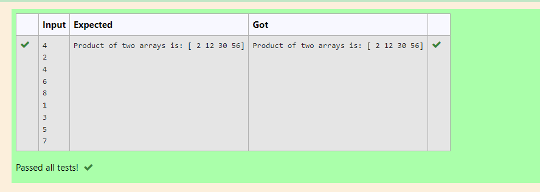

# Multiplying-two-matrix

## AIM:
 TO MULTIPLY TWO MATRIX
## ALGORITHM:

### Step 1: Import numpy as np
### Step 2: Create a empty list
### Step 3: From for append the two lists
### Step 4: Assign the arrays 
### Step 5: In result multiply the assigned variables
### STEP 6: Run the program

## PROGRAM: 
~~~
import numpy as np
l1,l2=[],[]
n=int(input())
for i in range(n):
    l1.append(int(input()))
for i in range(n):
    l2.append(int(input()))
A=np.array(l1)
B=np.array(l2)
result=(A*B)
print("Product of two arrays is:",result)
~~~
## OUTPUT:

## RESULT:

The multiply of matrix is successfully completed